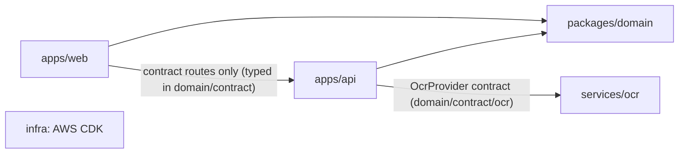
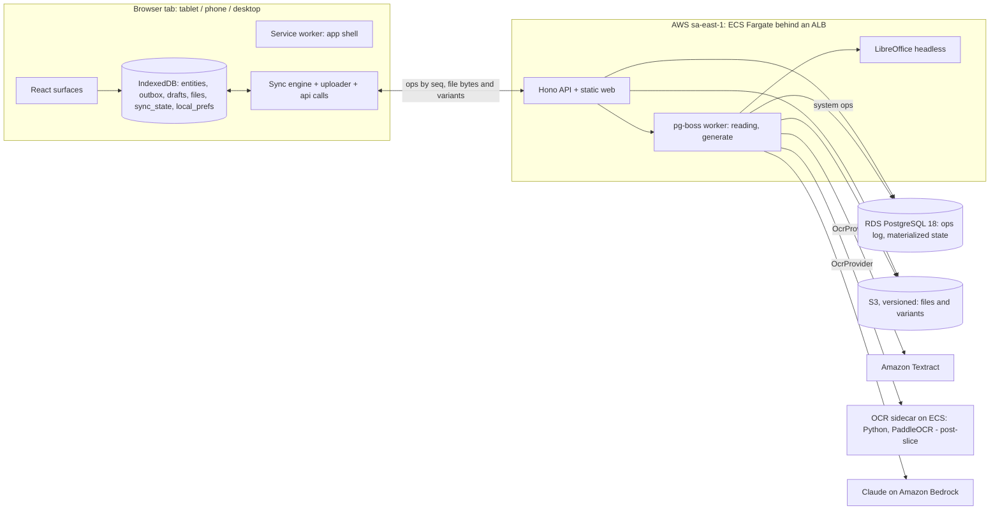
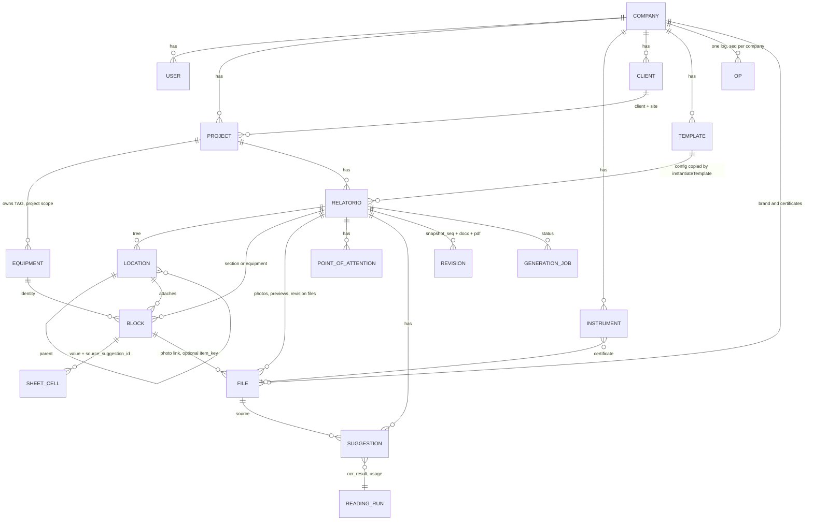

# Architecture Spine — fasor

Fast path. Every inference the sources did not settle is tagged `[ASSUMPTION]`; `[ADOPTED]` marks what the PRD, the UX spines or the user already decided. Rationale lives in `.memlog.md`. Vocabulary follows the user's decision of 2026-09-19: the unit of delivery is a **relatório** (the PRD glossary still says Laudo; see Source deltas).

## Design Paradigm

**Local-first client with an operation outbox → thin sync API → modular-monolith server, over a shared pure domain kernel. One log, one cursor, one reducer: everything in state — including what the server produces — is an op.**

| Layer | Package | Holds |
| --- | --- | --- |
| Domain kernel | `packages/domain` | zod schemas (entities, `OpPath`, `RelatorioSnapshot`, `BlockConfig`, contract), seed data by version, `applyOp` reducer, merge policy, integrity and pre-issue checks, progress and sheet state, conclusion/parecer templates, TAG suggestion, pt-BR parse and format, status table, print functions (grouping, numbering, section 8). Pure TS: no I/O, no framework. |
| Client | `apps/web` | React UI over IndexedDB (Dexie). Reads only from the local store; writes only as ops into the outbox. Sync engine, file store and uploader, typed API calls, derived cross-cutting state, service-worker shell. |
| Server | `apps/api` | Hono HTTP API serving the web bundle and `/api/*`, Drizzle/Postgres, pg-boss jobs (reading, generate), object-storage adapter, auth. Applies ops, emits system ops, renders documents. |
| OCR sidecar (post-slice) | `services/ocr` | Stateless Python service behind the `OcrProvider` contract for seven-segment display readings (FR-36). |



Dependency direction is a rule (AD-13): arrows only point as drawn.

## Invariants & Rules

### AD-1 — Local-first: the device store is the only thing the UI reads `[ADOPTED]`

- **Binds:** `apps/web`, all capture and review surfaces (FR-54, FR-55, FR-61, NFR offline)
- **Prevents:** half the screens reading from the network and half from the device.
- **Rule:** every screen renders from IndexedDB via `useLiveQuery`; every committed user write becomes an op in the outbox (AD-3) and is applied locally through `applyOp` before anything else; no component awaits an HTTP call to render or to persist a field. The only modules that call the network are `src/sync` (engine, uploader), `src/files` (on-demand variant reads) and `src/api` (one typed function per action route: `generate`, `preview`, `reread`, `signIn`, `signOut`); a lint rule forbids `fetch` elsewhere. Field commit granularity: one op per field commit — on blur, Enter, or 500 ms idle `[ASSUMPTION]`, whichever first; tri-state, chips, pickers and cells commit immediately. Uncommitted field text and unsaved dialog state are persisted to a per-user `drafts` table (keyed by surface and entity) on `visibilitychange`/`pagehide` and offered on reopen as "Rascunho encontrado — Recuperar", never applied silently; the outbox itself is not a draft.

### AD-2 — The domain kernel runs identically on device and server

- **Binds:** `packages/domain`, `apps/web`, `apps/api`; FR-17, FR-29, FR-30, FR-58, FR-60, FR-68, FR-71, FR-73
- **Prevents:** the Sumário row status and the Export pre-issue list disagreeing; two conclusion texts; two section-9 groupings; two definitions of "concluded"; counts computed in two places.
- **Rule:** the following exist once, as pure functions in `packages/domain` over `RelatorioSnapshot` (AD-15), entity rows or the op log: `applyOp`, `mergePolicy`, `integrity`, `preIssue` (whose rows are also the Sumário row statuses), `progress` and `sheetState`, `syncCounts(snapshot, outbox)`, `editedSince(snapshot_seq)`, `instantiateTemplate`, `suggestConclusionPair`, `composeConclusion`, `suggestParecer`, `composeParecer`, `suggestTag`, `suggestNameplateCopy`, `compareSuggestion`, `parse`, `format` (numbers, dates, units — the only formatter for UI and document), `deadlineFromPriority`, `contextCaption` (gender/number from registry metadata), `section11Instruments`, `calibrationCheck`, `groupForPrint`, `numberPhotos`, `extractPhotoRefs`, `resolveSection8`, `derivedPoints`, `statusTable`. Neither app may contain a function that takes a sheet, relatório or outbox and returns a status, count, text, order or verdict; `apps/web/src/state` renders kernel results, never counts. Enforced by one integration test that computes the Sumário rows on a Dexie store and the pre-issue list on Postgres for the Porto Seguro fixture and asserts identical kernel output, and by review.

### AD-3 — Unit of change is a typed operation in one log; `applyOp` is the only reducer

- **Binds:** every mutable entity, including server-produced state; `packages/domain/ops`; every emitter in `apps/web` and `apps/api`; the deferred merge and Conflict view (FR-58, FR-59)
- **Prevents:** two string encodings of one change; two materializers of one log; a second transport beside the op stream; a merge policy that cannot tell what a path means; a multi-device merge that needs a new op field.
- **Rule:** an op is `{op_id: uuidv7, kind: create|put|remove, scope: company|project|relatorio, company_id, project_id?, relatorio_id?, path, value, prev_op_id?, batch_id?, meta?, actor_id, device_id, client_ts, seq?}` with `project_id` required when `scope = project`, `relatorio_id` when `scope = relatorio`, and `seq` set only by the server. `OpPath` is a zod discriminated union of families in `packages/domain/ops/path.ts`, read and written only through `parsePath`/`formatPath`; `{field}` is a key of the target entity's zod schema and `parsePath` rejects unknown keys; `{kind}` is the enumerated registry kind list; the family list is versioned with the contract and append-only.
  Client families: `project/{id}` (create), `project/{id}/{field}`; `relatorio/{id}` (create), `relatorio/setup/{field}`, `relatorio/status`, `relatorio/export/scheme`; `location/{id}` (create), `location/{id}/{name|parent_id|order_key|removed_at}`, `location/{id}/se/{field}`, `location/{id}/env/{field}`, `location/{id}/agrupar_por_tipo`; `block/{id}` (create), `block/{id}/{location_id|order_key|removed_at|config|feeds_block_id|not_tested|concluded_by}`; `sheet/{blockId}/nameplate/{fieldKey}`, `sheet/{blockId}/checklist/{itemKey}/{result|observation}`, `sheet/{blockId}/test/{testKey}/{instrument|criterion_override}`, `sheet/{blockId}/test/{testKey}/cell/{row}/{col}`, `sheet/{blockId}/conclusion/{result|restriction|text|text_status|text_basis}`, `sheet/{blockId}/observations`; `equipment/{id}` (create, scope project), `equipment/{id}/{tag|removed_at}`; `file/{id}` (create), `file/{id}/{caption|block_id|item_key|removed_at}` (valid only on `kind = photo`); `point/{id}` (create), `point/{id}/{field}`; `suggestion/{id}/status`; `registry/{kind}/{id}` (create), `registry/{kind}/{id}/{field}`; `template/{id}` (create), `template/{id}/{field}`; `user/{id}/{field}`.
  Server-only families, emitted with `actor_id = system:{files|reading|generate|sync}` and `device_id = server`, rejected from a client push with `403 op_server_only`: `file/{id}/{uploaded_at|variants|reading_status}`, `suggestion/{id}` (create), `equipment/{id}/last_nameplate`, `generation_job/{id}` (create), `generation_job/{id}/{status|error|result_file_id}`, `revision/{id}` (create), `relatorio/preview_file_id`.
  A `create` carries the full row schema as `value`; a second `create` on the same id is a no-op; `remove` sets `removed_at`, "Restaurar" is a `put` of `removed_at = null`; reorder is a `put` on `order_key` (fractional index). No wildcard paths: a bulk action is N ops sharing one `batch_id`, undo is N inverse ops in a new batch. `prev_op_id` is the last op the device had applied on that path (null when none); the MVP policy ignores it, the deferred merge dispatches on it and on `parsePath(path).family`. `applyOp(state, op)` in `packages/domain/ops/apply.ts` is the only materializer, called by the Dexie layer and the Drizzle layer; it also materializes derived columns (AD-12 provenance, AD-18 attribution). The server assigns a monotonic `seq` per company on apply; last-writer-wins is by `seq`; `client_ts` is display and audit only. The outbox coalesces consecutive `put` ops on one path from the same device only when neither op has `meta` or `batch_id`, keeping the last `op_id`, `value`, `client_ts` and the first `prev_op_id`. Test: the same op log replayed in `seq` order through both layers yields byte-equal `RelatorioSnapshot`s, with no excluded fields.

### AD-4 — Identifiers are client-generated UUIDv7

- **Binds:** every entity, file, suggestion and op
- **Prevents:** offline creation waiting for a server id; duplicated rows on retried uploads.
- **Rule:** ids are UUIDv7 minted where the row is born; the one exception, stated: the server mints ids only for rows the server creates (suggestions, generation jobs, revisions, server-made files). The server never assigns an id to a client-created row and never reuses one. Every upload and op is deduplicated by id, including across overlapping pulls.

### AD-5 — Ownership map

- **Binds:** data model, sync scoping, TAG identity, relatório creation (FR-7, FR-13, FR-15, FR-24, FR-34)
- **Prevents:** two owners of one entity; template edits leaking into relatórios; the server copying a template.
- **Rule:**
  - **Company** (tenant) owns users, Templates, Projects and all registries (Empresa, Clients, Instruments, Manufacturers, Voltage classes, Atividades, Locais, Criteria).
  - **Project** = one client + one site; `[ASSUMPTION]` Site is collapsed into Project (resolves PRD Q4). Project owns **Equipment** `{id, project_id, tag, type, last_nameplate?, removed_at?}` in one company-wide table indexed by `project_id`; an Equipment block references `equipment_id`, so renaming a TAG keeps identity. Uniqueness of `(project_id, tag)` is a kernel `integrity` check on both sides, not a database constraint (AD-24). Equipment is never hard-deleted while a block references it.
  - **Relatório** owns its Location tree, blocks, sheet values, photos, points of attention, suggestions, generation jobs, revisions and its `export.scheme`. Creation is one client batch: `relatorio/{id}` create plus the `location/{id}`, `equipment/{id}` and `block/{id}` creates produced by kernel `instantiateTemplate(template, project, inputs)`, which copies the Template's `BlockConfig`s and skeleton (`template_id`, `template_version`, `seed_version` kept); the server never copies; a Template edit never touches an existing relatório by construction.
  - **Cabine** (root Location node) owns SE characteristics, test environment and `agrupar_por_tipo` (AD-6); sheets read them, never store them.
  - A company- or project-scope row never references a relatório-scope row (kernel schema test); relatório-scope rows reference company-scope rows by id, and the cycle order in AD-24 guarantees the referent is present.

### AD-6 — Location is a tree node that carries the cabine data; "first sheet" is computed

- **Binds:** tree, Template skeleton, "Da cabine" block, `groupForPrint` (FR-10, FR-17, FR-24, FR-68, PRD Q13)
- **Prevents:** a third named concept ("panel"); cabine data stored on a sheet; two meanings of "first sheet"; section-9 pairing by string matching.
- **Rule:** `location {id, relatorio_id, parent_id?, kind: cabine|coluna, name, order_key, se?: {type, primary_kv, secondary_kv, installed_kva}, env?: {altitude_m, temperature_c, humidity_pct}, agrupar_por_tipo?, removed_at?}`; `se`, `env` and `agrupar_por_tipo` are valid only on `kind = cabine` (zod refinement) and written only through their own families. Depth is not enforced in code; the UI renders two levels; an Equipment block attaches to any node. The "Da cabine" block is a view on whichever block `firstInTree(cabineId)` returns and prints on whichever block `groupForPrint` emits first for that cabine — computed, never stored. "Cabine anterior" is the previous root node by `order_key`. A block's `role` lives only in its `BlockConfig` (AD-21); `block.feeds_block_id?` links a cabos-de-saída block to its transformador; `groupForPrint` pairs by `feeds_block_id` only and prints an unpaired cable at the end of the transformer group with an `integrity` warning. `[ASSUMPTION, from UX]` in a cabine with `agrupar_por_tipo` on, para-raios and cabos de entrada/saída print inside the Seccionadoras group in tree order (PRD Q18).

### AD-7 — File entity, durability contract and photo variants

- **Binds:** `packages/domain/schemas/file`, `apps/web/src/files`, uploader, `apps/api` files route and `sharp`, reading job, Suggestion field, generate job, Registries and brand surfaces (FR-1, FR-3, FR-16, FR-33, FR-41, FR-42, FR-43, FR-45, FR-56, FR-57, FR-67, FR-70)
- **Prevents:** a file row born outside the log; a file held only in memory; two identity rules for photo and file; a crop drawn on a thumbnail; a document that embeds originals; a device throwing away the evidence a suggestion needs.
- **Rule:** `file` is one zod discriminated union on `kind ∈ {photo, certificate, logo, cover_background, watermark, cover_photo, preview, docx, pdf}` with common fields `{id, company_id, relatorio_id?, sha256, mime, size, uploaded_at?, variants?: {thumb, print}, removed_at?}`; the `photo` variant adds `{captured_at, tz_offset, coords?, local_seq, block_id?, item_key?, caption?, reading_kind?, reading_target?, reading_status}`. Accepted types: `photo` jpeg|png|heic→jpeg, `certificate` pdf|jpeg|png, `logo` png|svg, the rest jpeg|png; `PUT` bodies over 25 MB `[ASSUMPTION]` are refused `413 file_too_large`. Owners point at files, never the reverse: `registry/instrument/{id}/certificate_file_id`, `registry/empresa/{id}/{logo|watermark|cover_background}_file_id`, `relatorio/setup/cover_photo_file_id`. `file/{id}` create is a client op (`scope: company` for brand and certificates, `scope: relatorio` for photos and cover photos), emitted in the same batch as the row that links it; the Blob is written to IndexedDB in the same transaction; the uploader never `PUT`s a file whose create op is still pending or dead. The stored original of a photo is the camera output re-encoded on the device at capture to JPEG, long edge ≤ 2560 px, quality 0.85 `[ASSUMPTION]`, EXIF orientation applied, EXIF time and GPS parsed on the device; that is the original for every consumer. `PUT /api/files/{id}` is idempotent (carries `sha256`; a retry re-sends the whole object), requires an applied `file/{id}` create (`409 file_row_missing` otherwise), and on receipt the server emits `file/{id}/uploaded_at` and `file/{id}/variants` as `system:files` ops after making `thumb` (≤ 512 px) and `print` (≤ 2000 px long edge, JPEG q85) with `sharp`; the device makes its own `thumb` at capture and replaces it with the server's on pull. Object keys: `company/{cid}/{kind}/{id}` for company scope, `company/{cid}/relatorio/{rid}/{kind}/{id}` for relatório scope; keys are immutable, the bucket has versioning on, and the adapter has no delete in the MVP. `GET /api/files/{id}/{original|thumb|print}` is the only read route; the sync engine prefetches `thumb` only. The local original is not deleted at ACK: it is marked `acked` and is the first candidate for eviction under storage pressure, oldest-acked first, and evicted wholesale when the relatório leaves Rascunho/Em campo on this device; a Suggestion crop is rendered from the local original when present, else from `GET …/original` cached as a `crop` blob. Upload order: files with a pending reading first, then photos by capture time, then other kinds; two uploads in flight `[ASSUMPTION]`; one failed file never blocks the queue. The renderer embeds `print`, never `original`; certificate PDFs are rasterized page by page in the generate job (LibreOffice, 150 dpi) and SVG logos with `sharp`. Design capacity: 500 photos per relatório `[ASSUMPTION]`. Originals are retained after generation; purge is deferred.

### AD-8 — Offline vehicle, device availability and the Safari envelope

- **Binds:** `apps/web` shell, sync engine, Home cards, banners (FR-54, FR-55, FR-57, PRD Q0)
- **Prevents:** builders reaching for Background Sync, `persist()` or a home-screen install; unsynced work sitting on a tablet long enough to be evicted; Home cards rendered from nothing.
- **Rule:** a service worker precaches the app shell (`/`, hashed assets, the self-hosted Inter files, the SVG icon sprite) so a cold open of the tab works offline; `[ASSUMPTION]` asset caching is not "installation" under the web-only decision; no manifest install prompt, no Background Sync API, no reliance on `persist()`. The sync engine runs only while the tab is open: on launch, on the `online` event, every 60 s `[ASSUMPTION]`. A local `sync_state` row per stream (one per relatório, one with id `company`) holds `{cursor_seq, complete, files_pending, downloaded_at, last_sync_at, last_push_at[]}` and feeds the card states "No aparelho", "Baixando… n de m", "Não está neste aparelho"; the company pull's per-relatório `summary` is `progress(snapshot)` computed on the server and rendered by the same component as the local result. Pulled automatically: every relatório of the company in Rascunho or Em campo, no cap `[ASSUMPTION]`, the company scope (registries, Templates, Projects, users) and `thumb` variants; Em revisão and Emitido relatórios are pulled on open. When the outbox or file queue holds items older than 5 days `[ASSUMPTION]` a warning banner appears. If the origin's storage was evicted (session cookie present, database absent), the app shows a one-time screen naming what the server holds and re-pulls. Storage: warn when `navigator.storage.estimate()` reports under 500 MB free `[ASSUMPTION]`; capture is still attempted; on refusal the photo is uploaded immediately when online, else kept in memory for one retry and the error toast shown. PRD Q0 failure branch: if the two-day iPadOS check fails, the slice ships for Android Chrome and desktop only and FR-56 stays unchanged.

### AD-9 — Session, origin and per-user local store

- **Binds:** `apps/api` auth and static serving, `apps/web` bootstrap, FR-6, State "Session expired while offline"
- **Prevents:** two users on one tablet sharing an outbox; a 401 discarding queued work; cookie/CSRF/CORS answered twice.
- **Rule:** the api image serves the built `apps/web` as static files on the same origin; API routes live under `/api/*`; no CORS; local dev uses the Vite proxy to the same paths. Email + password through better-auth at `/api/auth/*`, httpOnly cookie `SameSite=Lax; Secure`, 30-day sliding `[ASSUMPTION]`; sign-in needs connectivity, the session continues offline. The Dexie database is `releng-{user_id}`; sign-out never drops it; a 401 during sync keeps the outbox intact and raises the re-auth banner. Users are provisioned and passwords reset by a seed CLI; no signup, no outbound e-mail. The user-visible product name comes from one config constant (`PRODUTO` until named); the codename never appears in a user-visible string, document or file name.

### AD-10 — Tenant scoping is explicit on every read

- **Binds:** `apps/api` repositories and jobs; every table
- **Prevents:** a cross-tenant read appearing the day a second company is seeded.
- **Rule:** the Drizzle layer adds `company_id` to every table; kernel entity schemas carry it only on `op` and `file`, and `toSnapshot()` strips it. The API resolves `company_id` from the session once per request and every repository function takes it as a required typed argument; a query without it does not compile. One test seeds two companies and asserts no cross-read. Row-level security is deferred, not replaced.

### AD-11 — Field kinds and value shapes

- **Binds:** `packages/domain/seed` field definitions, every `sheet/*` and `location/*/se/*` value schema, reading job, `last_nameplate`, copy actions, criteria comparison, derived cells, generation (FR-5, FR-22, FR-27, FR-28, FR-33, FR-35, FR-37)
- **Prevents:** one path with two value shapes; `3.300` read two ways; floats in storage; parse at read time; a derived value being typed; digit coverage skipping the field where a misread is invisible.
- **Rule:** every nameplate, SE and measurement field definition carries `kind ∈ {text, number, date, select, manufacturer, voltage_class}`, `unit?` (for `number`, fixed by the definition) and `options?` (for `select`). Value shape by kind: `number` → `{raw: "3300", unit: "MΩ", state: measured|not_measured|empty}` with `raw` a decimal string using `.`; `date` → ISO `YYYY-MM-DD` or `YYYY-MM`; the others → string. The zod schema for a path family validates the value against the definition resolved by `(seed_version, block_type, fieldKey)` on both sides. pt-BR parsing (comma decimal, point thousands, unit suffix `147G`) lives only in `packages/domain/parse` and runs at the input boundary — the UI and the reading job — and is echoed back before comparison; output formatting only in `packages/domain/format`. Criteria comparison, magnitude-outlier check and `VAL CALCULADO` are kernel functions; derived cells are never stored as input. A per-sheet criterion override is `sheet/{b}/test/{t}/criterion_override = {operator, value, unit, source}` and prints with its source. Digit coverage (AD-12) applies to every field whose value contains a digit, in every kind: `digits(value) === digits(concat(cited tokens in reading order))`, where `digits()` keeps only `0-9`.

### AD-12 — A Suggestion is an entity whose lifecycle is ops; provenance is a column

- **Binds:** every camera assist (FR-33, FR-35, FR-36, FR-37, FR-38, FR-39, FR-42, FR-75), reading job, Suggestion field, `applyOp`, sheet cell schema, progress, pre-issue, sync counts (FR-41, FR-60, FR-73)
- **Prevents:** an unconfirmed value written, counted or printed; a confirm indistinguishable from a typed value; provenance living only in the log; "pending" inferred two ways; an auto-confirm nobody emits.
- **Rule:** `suggestion {id, relatorio_id, target_path, value, trust: suggested|verify, mode: fill|replace, source: {photo_id, bbox: [x0,y0,x1,y1] normalized, ocr_token_ids, reading_run_id}, status: pending|confirmed|discarded, prompt_version}`. The reading job emits `suggestion/{id}` create ops with `status = pending` only. Every sheet cell is `{value, source_suggestion_id: uuid | null, op_id}`; `applyOp` sets `source_suggestion_id` from `meta.source_suggestion_id` and to `null` on any later `put` without it; the glyph is "cell with `source_suggestion_id ≠ null`" and its crop is that suggestion. "Confirmar" is one batch of two ops: `suggestion/{id}/status = confirmed` and `{target_path} = value` with `meta.source_suggestion_id`; typing into a pending target emits the value op plus `status = discarded` in one batch; "Confirmar todos" is one batch that skips `verify`. Comparison happens on the device, where both values are known: on applying a `suggestion/{id}` create whose target cell is non-empty, the device runs `compareSuggestion(cell.value, suggestion.value, fieldDef)` — equal → it emits the confirm batch as the current user with `meta.auto = true`; different → the suggestion stays pending with `mode = replace` ("Sugerido: … — Substituir"). Pending is the stored `status`, never inferred; progress, pre-issue, `syncCounts` and the renderer ignore anything not confirmed; `RelatorioSnapshot` includes exactly the suggestions referenced by a current cell. A value is `suggested` only when it passes digit coverage (AD-11) over the OCR tokens the model cited; otherwise `verify` — checked on the server in the reading job, never taken from the model. Device-computed suggestions (conclusion pair, conclusion text, parecer, deadline from priority) are not rows: the kernel derives them on read; `conclusion/text` is written only by "Confirmar" or "Editar" (`text_status ∈ {confirmed, edited}`, `text_basis` = hash of the inputs at that moment), the unconfirmed text is derived and never an op, and the renderer prints the text only when `text_status = edited` or `text_basis` equals the current hash. SM-C1 is server-side instrumentation over the ops table.

### AD-13 — Dependency direction and the API contract

- **Binds:** all packages
- **Prevents:** server code creeping into the bundle; client and server disagreeing on a wire shape; contract skew handled two ways.
- **Rule:** `packages/domain` imports nothing app-specific (zod only). `apps/web` and `apps/api` import `packages/domain`; `services/ocr` consumes the JSON Schema exported from `packages/domain/contract/ocr` (validated with pydantic generated from it). The client speaks to the server only through the routes typed in `packages/domain/contract` (zod request/response schemas, `CONTRACT_VERSION` sent as a header): `POST /api/sync/ops`, `GET /api/sync/company?since={seq}`, `GET /api/sync/relatorios/{id}?since={seq}`, `PUT /api/files/{id}`, `GET /api/files/{id}/{variant}`, `POST /api/relatorios/{id}/generate`, `POST /api/relatorios/{id}/preview`, `POST /api/photos/{id}/reread`, `GET /api/revisions/{id}/{docx|pdf}`, `GET /api/relatorios/{id}/preview.pdf`, `/api/auth/*`, `GET /api/health`. Error envelope `{code, message, details?}` with `code` strings enumerated in the contract. Skew: families and routes are append-only, so a push is accepted from any client whose `CONTRACT_VERSION` ≥ the server's minimum; only a pull answers `426 contract_outdated` to an outdated client, which keeps pushing, stops pulling without advancing its cursor, and shows a full-screen "Atualizar" state; a pull never advances the cursor past an op the device cannot parse. Package boundaries plus `eslint no-restricted-imports` enforce the direction.

### AD-14 — Reading pipeline (camera assists)

- **Binds:** `apps/api/jobs/reading`, `packages/domain/contract/ocr`, `services/ocr`, photo rows, FR-33, FR-35, FR-37, FR-42 in the slice; FR-36, FR-38, FR-39, FR-75 later
- **Prevents:** each assist growing its own model call, prompt and grounding rule; a retried job duplicating suggestions; a failed reading indistinguishable from "no result yet"; boxes in a preprocessed frame; the LLM and the OCR seeing different pixels.
- **Rule:** a photo row carries `reading_kind?: plate|display|caption|panel|nc_obs`, `reading_target?: {block_id, block_type, table_key?, start_cell?, item_key?}` assigned on the device at capture, and `reading_status: none|queued|running|done|failed` written by `system:reading` ops. File receipt with a `reading_kind` enqueues one pg-boss `reading` job with singleton key `(photo_id, reading_kind)`. The job has two steps behind two interfaces declared in `packages/domain/contract/ocr` and implemented in `apps/api/jobs/reading`: `OcrProvider.read(image) → {image: {width, height}, tokens: [{id, text, bbox}], preprocessing_applied}` and the LLM structuring step. **The LLM never emits coordinates**: every `bbox` comes from the OCR layer and the model only cites `ocr_token_ids`. The job sends the `print` variant to the OCR provider and the same bytes to the LLM; a provider returns `bbox` in the pixel space of the bytes it received, mapping back any internal preprocessing (deskew, glare removal, crop) or returning `preprocessing_applied: false` and skipping it; `id` is `t{index}` within one result, one token per word as the provider segments it; the job normalizes boxes over that image, which by AD-7 shares the original's aspect and orientation. `OcrProvider` implementations: `textract` (Amazon Textract `DetectDocumentText`, WORD blocks with bounding boxes; the slice: nameplates and printed text) and `ocr-svc` (the Python sidecar `services/ocr`: FastAPI + PaddleOCR PP-OCRv5 detection + PARSeq recognition + OpenCV preprocessing), selected per `reading_kind` by config; `display` readings route to `ocr-svc` when FR-36 ships `[ADOPTED 2026-09-21]`. The structuring step calls Claude on Amazon Bedrock through `@anthropic-ai/bedrock-sdk` (the Mantle client, model `anthropic.claude-opus-5` `[ASSUMPTION]`; `anthropic.claude-sonnet-5` is the cost fallback, a config change) with structured output (`output_config.format`); the first-party `@anthropic-ai/sdk` client is the same-interface fallback, selected by config, for a feature that lags on Bedrock or while the AWS account does not exist — the exception AD-27 allows. Both steps are selected by environment: `LLM_PROVIDER ∈ {fake, anthropic, bedrock}` and `OCR_PROVIDER ∈ {fake, textract, ocr-svc}`; `fake` replays fixtures from `apps/api/src/jobs/reading/fixtures` so development, tests and the docker-compose default run with no LLM or OCR service and no cost, and the POC phase uses `anthropic` with a Console API key until Bedrock is provisioned `[ADOPTED 2026-09-21]`. A personal Claude subscription is never used by the backend: Anthropic's terms restrict subscription OAuth to Claude Code and native apps and forbid routing an application's requests through Pro/Max credentials; given the image, the OCR tokens and the field definitions (AD-11), required to cite token ids per value; the job produces values in their kind's shape, applies digit coverage, cross-checks `manufacturer` and `voltage_class` fields against the registries (FR-35), deletes its own previous pending suggestions, and emits suggestion ops (AD-12). Each run writes a `reading_run {id, photo_id, reading_kind, ocr_provider, ocr_result (normalized boxes), model, prompt_version, llm_usage: {input_tokens, output_tokens, usd}, duration_ms}` row so `ocr_token_ids` resolve after the job; a `reread` creates a new run. Three attempts with backoff, then `failed`; `POST /api/photos/{id}/reread` re-enqueues. Cost envelope at Opus 5 first-party prices `[ASSUMPTION; Bedrock is billed separately by AWS]`: about USD 0.03 per plate (USD 3 per job), USD 0.03 per display shot (USD 33 per job when FR-36 ships), USD 0.03 per caption; Textract about USD 2 per job (USD 1.50 per 1000 pages); the sidecar costs compute only. Nothing runs on the device; the conclusion text is a kernel template, not a reading. The sidecar speaks only to the reading job and holds no state.

### AD-15 — One renderer, server-side, over a kernel-typed frozen snapshot

- **Binds:** `packages/domain/schemas/snapshot`, both `toSnapshot()` adapters, `apps/api/jobs/generate`, Export dialog, revisions (FR-62 to FR-70, FR-74, FR-48, FR-1 preview)
- **Prevents:** the PDF and the DOCX diverging; a preview rendered by a second path; the pre-issue list and the document disagreeing about what exists; a TOC that depends on which application opens the file; a failed generation consuming a revision number; "edited since" decided two ways.
- **Rule:** `RelatorioSnapshot` is a zod schema in the kernel (relatório, tree, blocks with `BlockConfig` and `seed_version`, sheet cells with `source_suggestion_id`, files with variants, points, the suggestions referenced by cells, tombstones excluded, plus the referenced registry rows and the Empresa); `toSnapshot()` exists in `apps/web/src/db` and `apps/api/src/sync`, and the replay test asserts both are byte-equal. `POST /api/relatorios/{id}/generate` carries `{last_op_id, file_ids_expected}` where `last_op_id` is the newest acked op; the server answers `409 not_caught_up` until every listed op is applied and every file stored; the Export dialog first drives the sync engine to flush ("Enviando…") and is blocked while any op is pending or dead. The job emits `generation_job/{id}` create (`kind: issue|preview`), freezes the snapshot, builds the DOCX with the `docx` library from a layout spec, and converts it to PDF with LibreOffice headless inside the same job — the input is the job's own DOCX, never one that left the system, which satisfies FR-62. The TOC is static and produced in two passes: pass 1 renders the TOC with its final entry list and fixed-width placeholder numbers, the heading pages are read from the PDF outline, pass 2 writes them; the job asserts pass-2 heading pages equal pass-1 and runs a third pass if not. `PAGE`/`NUMPAGES` fields carry "Página X de Y". LibreOffice runs in the slice; the PDF is stored from day one and only its download waits for §7.3 item 2. Generate concurrency is 1 per instance with a per-job `-env:UserInstallation`. Revision files are `file` rows (`kind: docx|pdf`) created by `system:generate`; the revision op `revision/{id}` `{number, snapshot_seq, created_by, docx_file_id, pdf_file_id}` is emitted in the transaction that stores both files, so a failed job allocates none; `editedSince(snapshot_seq)` is the kernel predicate — exists an op with `seq > snapshot_seq` whose family ∈ {`relatorio/setup`, `location`, `block`, `sheet`, `file` (photo), `point`, `equipment`} — used by the revision guard (a generate with `editedSince = false` returns the last revision), the Home banner and AD-22; system ops and `suggestion`, `relatorio/status`, `registry`, `template`, `user` families never count. Preview is the identical job with a RASCUNHO watermark; every preview is a new `file` row (`kind: preview`) referenced by `relatorio/preview_file_id` (system op) and served at `GET /api/relatorios/{id}/preview.pdf`; old previews are orphans until the deferred purge; one test asserts preview and issued output differ only by watermark and revision line. `generation_job/{id}/{status|error|result_file_id}` ops let the Export dialog show "Gerando…" and failures. Company brand: logo as a header image, watermark and cover background as behind-text anchored images in the same mechanism as the RASCUNHO watermark, so the two stack. The FR-1 live brand preview is a CSS approximation of the page furniture, not a render.

### AD-16 — Capture order is not print order; the scheme is a typed field `[ADOPTED]`

- **Binds:** tree, renderer, `groupForPrint`, `relatorio/export/scheme` (FR-68, FR-72, PRD §12)
- **Prevents:** a builder sorting the tree to match the document; the renderer reading a flag the Export surface cannot set; three switches with no stated relation.
- **Rule:** tree order is a per-relatório `order_key` the engineer controls; the renderer never reorders the tree. `groupForPrint(snapshot, scheme)` with `scheme ∈ {por_local_e_tipo, ordem_de_campo}`; `scheme` is stored per relatório by `relatorio/export/scheme` (default `por_local_e_tipo`) and captured in the snapshot; the per-cabine `agrupar_por_tipo` applies only inside `por_local_e_tipo`; `ordem_de_campo` is the base case the other is built on. Whether the Export surface exposes the scheme is a UX decision (currently: not exposed); the kernel and the contract carry it either way.

### AD-17 — Time, coordinates, ordering and photo numbering `[ADOPTED]`

- **Binds:** every timestamp, photo rows, gallery, section 7, revisions (FR-8, FR-44, FR-45, FR-47, FR-48)
- **Prevents:** two devices interleaving differently; a re-export renumbering unchanged photos; two coordinate sources.
- **Rule:** wire and storage timestamps are UTC ISO 8601; a photo keeps `captured_at` (EXIF when present, device clock otherwise), `tz_offset`, `local_seq` (per-device counter), `coords?: {lat, lng, accuracy_m, source: geolocation|exif}` (Geolocation API at capture with a 5 s timeout when the user's `photo_location_enabled` is on, EXIF for imports, parsed on the device, never rewritten by the server, printed at 4 decimals, omitted when absent), `block_id?` and `item_key?`. Display and document use America/Sao_Paulo. Photo sort key is `(captured_at, device_id, local_seq)`. Numbers are assigned by `numberPhotos` at generation from the snapshot and frozen with the revision; before export they are provisional.

### AD-18 — Sheet state precedence and attribution

- **Binds:** `sheetState`, `progress`, `preIssue`, `composeConclusion`, `syncCounts`, `block` value schemas, renderer, SM-8 instrumentation (FR-31, FR-32, PRD Q3)
- **Prevents:** a state with two answers; two attribution transports; a one-tap fix by a second user re-attributing a signed sheet; disabled sub-blocks counted on one side and not the other.
- **Rule:** `block/{b}/not_tested` value is `{reason: seed key, text?, at, by} | null` with reasons from the seed's `not_tested_reason` list; `block/{b}/concluded_by` value is `{actor_id, at} | null`. `sheetState` precedence: `not_tested ≠ null` → Não ensaiada; else `concluded_by ≠ null` → Concluída (kept through later edits; `integrity` flags "concluída com pendências" when `progress` is incomplete); else any non-empty enabled cell → Em preenchimento; else Vazia. `created_by` is the create op's `actor_id`; `first_edited_at`, `last_modified_by` and `last_modified_at` are materialized by `applyOp` from ops under `sheet/{b}/*`, `block/{b}/not_tested` and photo files with `block_id = b`, never emitted. The document prints `concluded_by`, falling back to `last_modified_by` `[ASSUMPTION]`. Values in a sub-block with `enabled = false` are retained in state and ignored by `progress`, `preIssue`, `composeConclusion` (so `text_basis` excludes them), `integrity`, `syncCounts` and the renderer; re-enabling brings them back.

### AD-19 — Registry references: by id for Instruments and Clients, by value for the rest; instrument header captured at selection

- **Binds:** sheet schema, registries, renderer sections 9 and 11, pre-issue calibration check (FR-3, FR-4, FR-27, FR-70, FR-73)
- **Prevents:** the "Schneider" / "SCHNEIDER" merge requiring reference rewriting on every device; a calibration record changing under a signed reading.
- **Rule:** Clients are referenced by id. Selecting an instrument writes one op whose value is `{instrument_id, code, manufacturer, model, serial, cert_number, calibrated_at, valid_until, test_parameter}` copied at that moment; the sheet and the renderer print the copied values; section 11 resolves the certificate file by `instrument_id → certificate_file_id` and flags a `cert_number` mismatch in `integrity`; `calibrationCheck` compares `valid_until` with the relatório's service period end, "expiring" within 30 days after it. Manufacturer, Voltage class, Atividade and Local are stored by value on the sheet or caption; their registries are suggestion lists with `{name, gender, number}` metadata, deduplicated server-side by normalized name without touching sheets. Consequence, stated: a sheet prints the spelling the engineer chose; FR-4's "every sheet still pointing at it" is met by value, not by reference.

### AD-20 — Soft delete with tombstones

- **Binds:** blocks, locations, equipment, files, points (FR-19, FR-59 later)
- **Prevents:** a removed row physically deleted on one path and recoverable on another.
- **Rule:** removal is a `remove` op setting `removed_at`; "Restaurar" clears it; the renderer, counters and snapshot ignore tombstoned rows; purge is a deferred server policy, never a client action.

### AD-21 — Seed data is versioned code; `BlockConfig` is the only thing copied

- **Binds:** `packages/domain/seed`, `packages/domain/schemas/block`, Template rows, Block rows, Block palette, "Duplicar", renderer (FR-5, FR-9, FR-11, FR-13, FR-22, FR-31, addendum §9)
- **Prevents:** field lists living in a row and in the kernel; a seed change rewriting open relatórios; the renderer using a different seed than the sheet.
- **Rule:** `BlockConfig = {block_type, subtype?, role?: entrada|saida|alimentacao, sub_blocks: Record<SubBlockKey, {enabled, options?}>, na_defaults: ItemKey[]}` is a kernel zod schema with enumerated keys and option names, and the only home of `role`; a Template block is `BlockConfig + {quantity, skeleton_location_ref}`; a Block row stores one `BlockConfig` (copied at creation, editable per sheet through `block/{id}/config`) and a `seed_version`. Definitions — the eight block types' field definitions with kinds (AD-11), the five checklist lists, the four table grammars, criteria `{operator, value, unit, type, source: {name, edition?}}`, the `not_tested_reason` list with its justification text, section boilerplate keyed by `(section, effective_from)` (the NR-10 text-by-date slot; the MVP seeds only the current text) — are never copied into a row; they resolve through `getDefinition(seed_version, report_type, block_type)` with `report_type = "cabine_primaria"` as the only value. `packages/domain/seed` is append-only by version so every bundle resolves every version it shipped; a Template records its `seed_version` and passes it to the relatório; a block added in the field takes the relatório's version. The seed's source of truth is the decoded FO.SERV-03 document, not the UX counts; the two checklist column orders normalize to one and `EPÓXI`/`EPOXI` to one value. Kernel tests reject a criterion without operator, type or source (edition nullable, "aceitável na ficha" allowed). Renderer rule: a sub-block with `enabled = false` is omitted; the four Bloco C grid columns the MVP does not capture print "-" and are not sub-blocks.

### AD-22 — The status table has one home, with a provisional content

- **Binds:** relatório status, Home grouping, Export, Setup surface (FR-21, PRD Q2)
- **Prevents:** two surfaces deciding differently what an export does to Em campo; two emitters of one transition.
- **Rule:** `packages/domain/status` holds the `(state, event) → state` table; every transition is a client op on `relatorio/status`; the server never writes it. Provisional table `[ASSUMPTION]`: `Rascunho —setup_complete→ Em campo` (emitted by the Setup surface when `integrity` reports setup complete); `Em campo —generate→ Em revisão` (emitted by the Export dialog before calling generate; generating while Em campo is allowed and warned); `Em revisão —issue→ Emitido`; `Emitido —edit→ Em revisão`, where "edit" is any client op in the `editedSince` family set (AD-15) and the emitting device appends the status op to the same batch, computed by `statusTable`; manual backward moves allowed from any state through the confirm dialog, and a later edit does not re-advance. The PM edits the table, not its location.

### AD-23 — UI system: the mockups' CSS is the design system, behavior from React Aria

- **Binds:** `apps/web` styling, components and input layer (DESIGN.md tokens; PRD §9 field ergonomics)
- **Prevents:** DESIGN.md values re-encoded into a framework theme; each component inventing its own touch and stylus handling.
- **Rule:** `tokens.css` (1:1 with DESIGN.md) and `components.css` are copied into `apps/web/src/styles` and are the styling layer; React components use those class names. Accessible behavior comes from React Aria Components, unstyled; state is mapped by render-prop `className` functions onto the CSS's `.is-*` and `[data-state]` selectors, one mapping helper per component, never by adding a second selector vocabulary. Disabled controls use `aria-disabled` plus an `aria-describedby` reason, never `isDisabled`. One shared input layer in `src/input` sets `touch-action`, pointer-type handling and press-and-hold; no hover-only affordance, no swipe. Inter is self-hosted and precached. No Tailwind, no component kit with its own theme.

### AD-24 — Sync order, rebase and rejection semantics

- **Binds:** `apps/web/src/sync`, `apps/api/src/sync`, files route, every emitter, the generate barrier (FR-42, FR-54, FR-56, FR-60)
- **Prevents:** a pull clobbering unsent work; a rejected op leaving device and server divergent forever, or blocking the barrier forever; a file arriving before the row that gives it meaning; a business rule enforced on one side only; a second pull channel.
- **Rule:** a cycle is push ops → upload files → pull company → pull each relatório. `POST /api/sync/ops` takes `{ops: Op[]}` (≤ 500, array order = apply order) and answers `{applied: [{op_id, seq}], rejected: [{op_id, code}], superseded: [{op_id, over_op_id}]}`; per-op atomicity, one rejected op never blocks the rest; `superseded` lists applied ops whose `prev_op_id` was not the server's current op on that path, shown in Sync status as information. The server rejects only for shape (`400 op_invalid`, `op_path_unknown`), server-only family (`403 op_server_only`) or tenant (`403`); it never rejects for a domain rule — duplicate TAG, unknown location, edit on a tombstone are applied and reported by the kernel `integrity` check, which feeds the pre-issue list and the sync status ("TAG SEC-C05 duplicada — Renomear"). A rejected op moves to `outbox.status = dead` with its code, is excluded from the materialized state (`applyOp` re-runs over the log minus dead ops for that entity), keeps its value in the outbox for "Reenviar", and is listed by `preIssue` ("N alterações rejeitadas — Reenviar"). Retry table: network and 5xx retried with backoff and jitter; 4xx never, except `401` (re-auth banner, outbox intact) and `409 file_row_missing` (retryable). A pull returns `{ops, seq, summary?}` and nothing else; the relatório stream is a query — ops with `relatorio_id = $id` ∪ ops with `scope = project and project_id = relatorio.project_id`, ordered by `seq`, `seq > since` — never a stored fan-out, so a relatório created later receives its project's whole history; the company stream is `scope = company`. Pulled ops are applied through `applyOp`, routed by `scope` (never by origin `relatorio_id`), deduplicated by `op_id` across streams; rebase means that after a pull, for every path with a pending outbox op, the device re-applies the pending op on top of the pulled value (`prev_op_id` untouched). The server stores `last_push_at` per `(user_id, device_id)` and returns it in the pull `summary` ("Último envio de Eduardo"), written to `sync_state`, never to an entity. Sync status and Sumário counts come from `syncCounts(snapshot, outbox)`.

### AD-25 — Equipment is project scope; the cross-visit copy is a server projection

- **Binds:** `packages/domain/contract`, both sync layers, block creation, `suggestTag`, `integrity` (FR-7, FR-18, FR-34, FR-38)
- **Prevents:** a Project-owned row with no sync path; a cross-visit read that needs a network; a TAG suggested from a partial view; a copy across seed versions writing orphan keys.
- **Rule:** `equipment/*` ops are `scope: project`; they reach every relatório stream of that project by the AD-24 query and land in one company-wide `equipment` table on the device. `suggestTag` and `integrity` read `equipment where project_id = relatorio.project_id and removed_at is null`. `equipment/{id}/last_nameplate` is a `system:generate` op emitted when a revision is stored, with value `{relatorio_id, revision_number, issued_at, seed_version, block_type, fields}` from that revision's snapshot — the only content of an Emitido relatório that reaches a device automatically. "Copiar da última visita" appears when the block's Equipment row has `last_nameplate ≠ null`, reads it from Dexie and writes plain-value ops for the keys that exist in the target block's definition at its `seed_version`, skipping the rest and reporting "N campos copiados"; it never fetches. "Igual à ⟨TAG⟩?" is `suggestNameplateCopy` over blocks of the same type and manufacturer in this relatório `[ASSUMPTION]`.

### AD-26 — Section 8 contract: inline photo tokens and derived untested entries

- **Binds:** `packages/domain/schemas/point`, `resolveSection8`, `derivedPoints`, Points surface, NC-row "Criar ponto", Não ensaiado action, renderer section 8, pre-issue (FR-48, FR-49, FR-51, FR-52)
- **Prevents:** a literal photo number in prose; a photo reference held in two places; untested equipment stored as a point and also derived.
- **Rule:** `point.text` is plain text whose only markup is `[[foto:<photo_id>]]`; there is no `photo_ids` field — references are `extractPhotoRefs(text)`; the composer inserts tokens from the gallery picker and renders them as chips; pre-issue flags a token whose photo is tombstoned. At render `resolveSection8(snapshot, numbering)` replaces tokens with "Imagem NN" and fills the table's Imagens column in order of first appearance. Untested entries are derived by `derivedPoints(snapshot)` from blocks in `not_tested` state, printed after the manual points in tree order with the reason and its justification text, never stored; a point created from an untested sheet carries `equipment_id` and `origin: not_tested`, which suppresses the derived entry; the table numbers manual then derived rows continuously.

### AD-27 — Containers everywhere, cloud-native, one cloud: AWS `[ADOPTED]`

- **Binds:** `apps/api` and `services/ocr` images, `docker-compose`, `infra/`, CI, every environment, every external service the system calls
- **Prevents:** "works on my machine" drift on the pieces that live in the image (Node, LibreOffice and its fonts, sharp's native binaries, the Python OCR stack); a cloud host that needs hand-installed runtimes; services scattered across providers with three IAM models and three bills.
- **Rule:** local development always runs through `docker-compose` (web dev server, api, Postgres 18, MinIO, and the OCR sidecar once it exists); no service is expected to run natively on a developer machine. The cloud is AWS, and every managed service the system uses comes from AWS unless AWS has no equivalent, in which case the exception is recorded here with its reason: containers on ECS Fargate behind an ALB with images in ECR (api + in-process worker as one service, the OCR sidecar as a second service later); RDS for PostgreSQL 18; S3 with bucket versioning; Secrets Manager; CloudWatch Logs; Amazon Bedrock for Claude; Amazon Textract for cloud OCR. Region `sa-east-1` for data at rest `[ASSUMPTION]`, with Bedrock through a global cross-Region inference profile where the model is not served locally. Infrastructure is code in `infra/` (AWS CDK in TypeScript `[ASSUMPTION]`); one image is built once per commit in CI and promoted `staging → production` unchanged; configuration enters only through environment variables and Secrets Manager. Switching a service inside AWS changes `infra/`, never application code, because every external call goes through an adapter (`src/storage`, `OcrProvider`, the LLM client).

## Consistency Conventions

| Concern | Convention |
| --- | --- |
| Naming | Code identifiers in English; `relatorio`, `cabine`, `ficha`, `parecer` are domain words and stay; TS `camelCase`, DB `snake_case` via Drizzle mapping; files `kebab-case`; op paths per AD-3; block type keys `cabos_entrada, para_raio, chave_seccionadora, disjuntor_mt, tp, tc, cabos_saida, transformador_forca`. |
| Data & formats | UUIDv7 ids (AD-4, `uuid` v7); timestamps per AD-17; value shapes per AD-11; `order_key` via `fractional-indexing`; pt-BR labels stored verbatim from FO.SERV-03; JSON on the wire; error envelope and retry table per AD-13/AD-24; `packages/domain/format` is the only formatter. |
| State & cross-cutting | All mutation through ops (AD-3); suggestions and provenance per AD-12; soft delete (AD-20); device-local never-synced state (last sheet on this device, theme override, dismissed banners, registry tab, gallery filter) in a `local_prefs` table; banner priority (conflict › re-auth › draft found › suggestions ready › relatório exported › offline › unsynced > 5 days; `426` is a full-screen state) and the Sync badge rendered once in `apps/web/src/state` from kernel results; config from environment variables validated by a zod schema at boot; structured JSON logs with `company_id`, `relatorio_id`, `job_id`; jobs record duration, `reading_run` records usage and USD. |
| Versioning | Dexie versions append-only with a mandatory `upgrade()` and an "outbox survives upgrade" test; `CONTRACT_VERSION` header and skew rule (AD-13); the service worker activates a new shell on the next launch only when the outbox is empty; migrations forward-only, run as a one-shot ECS task before the service rolls. |
| Testing | Kernel: Vitest unit tests including the seed tests (AD-21), the schema-reference test (AD-5) and the op replay test (AD-3); renderer: snapshot test on the Porto Seguro data set plus the draft-equals-issued test (AD-15); the AD-2 Sumário/pre-issue identity test; the AD-10 cross-tenant test; Playwright on desktop Chrome, Android Chrome emulation and the WebKit project for `src/db` and `src/sync`, with the three FR-54 scenarios by name (tab closed mid-sheet, network dropped mid-upload, quota exhausted via a mocked `storage.estimate`); iPadOS Safari eviction and camera checked manually on a device in the first two days (PRD Q0). |

## Stack

Verified current on 2026-09-21 (memlog and `reviews/review-versions.md`); the code owns these once `package.json` exists.

| Name | Version |
| --- | --- |
| Node.js | 24 LTS |
| TypeScript | 6.0 (last JS-based release; typescript-eslint supports < 6.1) |
| typescript-eslint | 8.70 |
| pnpm workspaces | 12 |
| React | 19.3 |
| Vite | 8.3 |
| React Router | 8.4 (library mode) |
| react-aria-components | 1.21 |
| Dexie + dexie-react-hooks | 4.4 |
| Zod | 4.6 |
| uuid (v7) | 11+ |
| fractional-indexing | 4.0 |
| exifr | 7.1 |
| heic-to (gallery imports; camera capture is already JPEG) | current `[ASSUMPTION]` |
| Hono | 4.13 |
| @hono/node-server | 2.1 |
| Drizzle ORM | 0.45 |
| drizzle-kit | 0.31 |
| postgres (postgres.js driver) | 3.4 |
| PostgreSQL | 18 (RDS and Aurora support 18.3 since 2026-06) |
| pg-boss | 12 |
| better-auth | 1.7 |
| docx | 9.7 |
| LibreOffice (Still, TDF .deb in the api image; Debian apt ships 25.2) | 26.2 |
| sharp | 0.35 |
| @aws-sdk/client-s3, @aws-sdk/client-textract | 3.1134 |
| @anthropic-ai/bedrock-sdk (Mantle client) | 0.33 |
| @anthropic-ai/sdk (fallback client) | 0.127 |
| aws-cdk-lib (`infra/`) | 2.269 `[ASSUMPTION]` |
| Cloud (AD-27) | AWS: ECS Fargate + ALB + ECR, RDS for PostgreSQL, S3, Secrets Manager, CloudWatch, Bedrock, Textract; region `sa-east-1` `[ASSUMPTION]` |
| Local (AD-27) | docker-compose: web, api, Postgres 18, MinIO, OCR sidecar |
| Vitest | 5.0 |
| Playwright | 1.63 |
| OCR sidecar (post-slice, FR-36): Python | 3.13 (PaddleOCR supports ≤ 3.13) |
| uv | 0.12 |
| FastAPI | 0.141 |
| PaddleOCR | 3.5 |
| PaddlePaddle | 3.4 |
| opencv-python | 4.14 |
| onnxruntime | 1.25 |

## Structural Seed

```text
fasor/
  packages/domain/          # pure kernel (AD-2): schemas/ (entities, snapshot, block-config, file, contract/, contract/ocr), ops/ (path, apply), seed/ (v1.ts, index.ts), merge/, checks/ (integrity, preIssue, progress, syncCounts), templates/, print/ (groupForPrint, numberPhotos, resolveSection8, derivedPoints), parse/, format/, status/
  apps/web/
    src/db/                 # Dexie schema (entities, outbox, drafts, files, sync_state, local_prefs), toSnapshot()
    src/sync/               # engine: push, upload, pull, rebase; fetch site 1
    src/files/              # capture re-encode, thumbs, on-demand variant reads; fetch site 2
    src/api/                # typed action calls: generate, preview, reread, signIn, signOut; fetch site 3
    src/state/              # renders kernel results: banner slot, sync badge, counts
    src/input/              # shared touch/stylus layer (AD-23)
    src/styles/             # tokens.css, components.css, self-hosted Inter, icon sprite
    src/surfaces/           # one folder per EXPERIENCE.md surface
    public/sw.js            # app-shell precache only (AD-8)
  apps/api/
    src/http/               # Hono routes from domain/contract; serves apps/web static on the same origin; /api/auth/*
    src/db/                 # Drizzle schema + migrations
    src/sync/               # apply ops, seq, stream queries, system ops, toSnapshot()
    src/jobs/reading/       # OcrProvider implementations (textract, ocr-svc) + Claude on Bedrock structuring (AD-14)
    src/jobs/generate/      # snapshot -> docx -> pdf, two-pass TOC, revision and last_nameplate ops (AD-15, AD-25)
    src/storage/            # S3 adapter: immutable keys, no delete in MVP (MinIO locally)
    Dockerfile              # node:24 + LibreOffice 26.2 (TDF .deb) + fonts
  services/ocr/             # post-slice Python sidecar (FR-36): FastAPI + PaddleOCR/PARSeq + OpenCV; stateless; pydantic from contract/ocr JSON Schema; python:3.13
  infra/                    # AWS CDK (TypeScript): VPC, ECS Fargate services, ALB, RDS, S3, Secrets Manager, IAM for Bedrock and Textract (AD-27)
  docker-compose.yml        # local: web, api, postgres:18, minio, ocr (profile)
  scripts/seed-users.ts     # provisioning and password reset
```





Environments (AD-27): `local` is docker-compose (web, api, Postgres 18, MinIO, OCR sidecar when present); `staging` and `production` are two AWS accounts or stacks in `sa-east-1` `[ASSUMPTION]` running the same images on ECS Fargate — one service for api + in-process worker (`WORKER=1`), a second service for the OCR sidecar when it exists — with RDS for PostgreSQL 18, S3 and Secrets Manager, all from `infra/`. CI builds each image once per commit, pushes to ECR and promotes it. Backups: RDS automated snapshots plus S3 bucket versioning; the adapter has no delete in the MVP. Observability: structured logs to CloudWatch plus `GET /api/health`; no APM in the MVP.

## Capability → Architecture Map

| Capability / Area | Lives in | Governed by |
| --- | --- | --- |
| Registries and identity (FR-1..FR-8) | company-scope ops, Registries and Account surfaces | AD-3, AD-5, AD-7, AD-9, AD-10, AD-19 |
| Templates and block model (FR-9..FR-14) | `packages/domain/seed`, `instantiateTemplate`, Template composer | AD-5, AD-6, AD-21 |
| Projects, relatórios, tree (FR-15..FR-21) | Sumário, tree, `equipment` table | AD-3, AD-5, AD-6, AD-16, AD-20, AD-22, AD-25 |
| Equipment sheet capture (FR-22..FR-32) | Equipment sheet surface, `parse`, `templates` | AD-1, AD-3, AD-6, AD-11, AD-12, AD-18, AD-19, AD-21 |
| Camera assists (FR-33..FR-42, FR-75) | `apps/api/jobs/reading`, `services/ocr`, Suggestion field | AD-7, AD-11, AD-12, AD-14 |
| Photos (FR-43..FR-48) | `src/files`, uploader, gallery | AD-7, AD-17, AD-20, AD-24 |
| Points of attention (FR-49..FR-53) | Points surface, `resolveSection8` | AD-3, AD-17, AD-20, AD-26 |
| Offline and sync (FR-54..FR-61) | `apps/web/src/sync`, `apps/api/src/sync`, `src/state` | AD-1, AD-3, AD-4, AD-8, AD-9, AD-13, AD-24, AD-25 |
| Generation (FR-62..FR-70, FR-74) | `apps/api/jobs/generate`, `packages/domain/print` | AD-7, AD-15, AD-16, AD-17, AD-19, AD-21, AD-26 |
| Pre-issue and parecer (FR-71..FR-73) | `packages/domain/checks`, Export dialog, Sumário rows | AD-2, AD-12, AD-15, AD-18 |
| Every surface | `apps/web/src/surfaces`, `src/styles`, `src/input` | AD-1, AD-13, AD-23 |
| Environments and delivery | `docker-compose`, Dockerfiles, CI, deploy manifests | AD-9, AD-27 |
| Multi-tenant / multi-type slots | schema, seed keys | AD-10, AD-21 |

## Source deltas

Decisions the sources must absorb so builders reading them do not build the wrong thing:

- **PRD glossary "Laudo" → relatório.** The user decided the vocabulary on 2026-09-19 (UX memlog); the PRD glossary predates it. Code, paths and routes use `relatorio`.
- **PRD FR-68/FR-72 section-9 option at export.** The UX removed the visible choice on 2026-09-19 and the PRD states that the spines win on interaction detail; AD-16 keeps the scheme in the kernel and contract, not in the Export dialog. The PRD text should say so.
- **PRD FR-22 nameplate field counts.** The seed follows the decoded document (addendum §9: para-raio 5, seccionadora 10, disjuntor 13, TC 14), not the counts in FR-22 and the EXPERIENCE Block Model table.
- **PRD FR-34 "TAG exists in a previous Laudo of the same site"** means an Equipment row of the project with `last_nameplate ≠ null` (AD-25), which also covers a renamed TAG.
- **Não ensaiado reasons.** The seed list is FR-31's attested set (Impossibilidade de desligamento, Solicitação do cliente, Outro) with the justification text per reason; EXPERIENCE.md's fourth chip "Acesso" is stale.
- **EXPERIENCE.md install surfaces.** The PRD decision of 2026-09-21 (web only, no install) removes the "App not installed" banner, Account › Instalar and the PWA sentence in Responsive & Platform; the unsynced-for-5-days and re-auth banners take slots in the banner priority. The two stale sentences about a section-9 choice "stored on the export revision" and the Revisões row column go too.
- **EXPERIENCE.md Offline › Automatic availability.** Thumbnails are pulled, originals on demand (AD-7, AD-8), answering the UX's open question.
- **EXPERIENCE.md "Igual à ⟨TAG⟩?"** is resolved as same type and manufacturer (AD-25), reconciling "same type" (Block Model) with "same type and model" (Smart Input).
- **EXPERIENCE.md dictation.** In the slice the Dictation button is always hidden (no engine), so Flow 2's count is read as the offline figure without dictation.

## Deferred

- **Multi-device merge policy and the Conflict view** (FR-58, FR-59, FR-60; PRD §7.3 wait 3): the op envelope with `prev_op_id` and the `superseded` signal (AD-3, AD-24) are the contract; the policy content, the conflict row and the UI wait.
- **Status table content** (PRD Q2): provisional in AD-22; the PM edits it.
- **Row-level security**: application scoping (AD-10) suffices for one tenant; enable RLS before the second company.
- **Purge and retention** of tombstoned rows, original photos, orphaned previews and past revisions.
- **Storage-low threshold**: provisional 500 MB (AD-8); the number is set after the iPadOS test.
- **Photo re-encode numbers** (AD-7): tuned after the first field trial.
- **Export time tolerance**: measured on the Porto Seguro data set; the job is asynchronous already.
- **Dictation engine** (FR-40) and **geolocation to altitude**: post-slice; the Suggestion entity and `location.env` already carry the results.
- **LGPD basis** for sending client photographs to the reading providers (PRD Q12): legal input; a consent gate is one check in the reading job.
- **"Salvar como template" carry list** (PRD Q5) and the **rich text editor** (FR-12): post-slice.
- **Cost fallback model** for readings: a config change once the per-reading cost log has real numbers.
- **OCR sidecar** (`services/ocr`): built when FR-36 "Ler visor" enters, after a spike on real megôhmetro display photos; its contract is `packages/domain/contract/ocr` from day one so the reading job never changes shape.
- **TypeScript 7** once typescript-eslint supports it; **LibreOffice 26.8** when 26.2 reaches end of life (2026-11-30).
